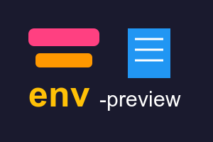

  

<h1 align="center">Env Preview for VS Code</h1>

  <!-- Add relevant badges here. Example: -->
  
  
  

 English | <a href="./README_zh.md">简体中文</a>

> Effortlessly preview environment variable values directly within your VS Code editor. Hover over an environment variable in your code to see its value from different `.env` files.

## ✨ Features

*   **Instant Preview**: Hover over an environment variable (e.g., `process.env.API_KEY` or `import.meta.env.VITE_USER`) to see its value.
*   **Multi-File Support**: Displays values from various `.env` files (e.g., `.env`, `.env.development`, `.env.production`).
*   **Quick Actions**:
    *   **Edit**: Directly jump to the variable definition in the corresponding `.env` file.
    *   **Copy**: Quickly copy the variable's value.
*   **Clear Identification**: Easily distinguish between different environment configurations (e.g., development, staging, production).

## 🚀 Installation

1.  Open **Visual Studio Code**.
2.  Go to the **Extensions** view (Ctrl+Shift+X or Cmd+Shift+X).
3.  Search for `Env Preview`.
4.  Click **Install**.

Or, install via the [VS Code Marketplace](https://marketplace.visualstudio.com/items?itemName=Simon-He95.env-preview).

## 💡 Usage

Once installed, simply open a project with `.env` files and hover your mouse cursor over an environment variable in your code (e.g., in a JavaScript, TypeScript, or other supported file types). A tooltip will appear showing the values from your configured `.env` files.

<!-- Consider adding a GIF or screenshot here demonstrating the hover preview -->
<!-- 
## Example Screenshot/GIF

  

 
-->

## 🙏 Sponsors

Support this project by becoming a sponsor. Your name will appear here and on my GitHub profile.

  

You can also [buy me a cup of coffee](https://github.com/Simon-He95/sponsor).

## 📄 License

[MIT](./LICENSE) © [Simon He](https://github.com/Simon-He95)
